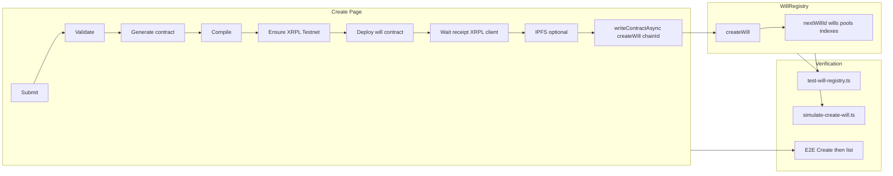
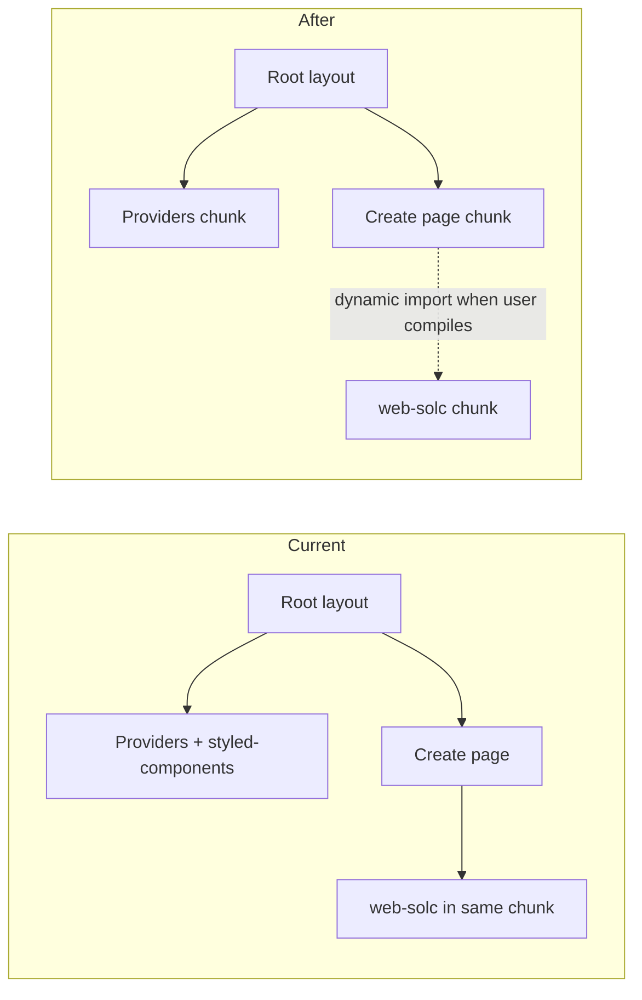

# Mega Plan: WillRegistry, Create Flow, Performance & Executor

Unified plan covering: (1) WillRegistry as source of truth and wills list flow, (2) create page structure and will parsing, (3) create-page/WillRegistry integration fixes, (4) page compilation speed improvements, and (5) executor menu and confirm-death flow.

---

## Review (hackathon lens)

**Strengths**
- **Single source of truth:** WillRegistry on-chain + 3s polling keeps the demo simple (no DB to sync). List and detail stay consistent.
- **Clear failure points:** Part 3 spells out chain/receipt/creator/gas/edit-page risks and verification steps so you can fix or skip with intent.
- **Executor story is defined:** Success → My Wills → will detail → Declare Death → Execute distribution; one real bug (no invalidate on chain success) and a small, scoped fix.

**Watch out**
- **Create flow is the critical path.** If createWill fails or the list doesn’t update, the whole demo breaks. Prioritize receipt client, creator checks, and scripts (`simulate-create-will`, `test-will-registry`) early.
- **Parser/UX improvements (Part 2)** make the create flow look good but depend on the create→registry path working first. Do structure (two sections, aggregation) before spending time on prompt tuning.
- **Compilation speed (Part 4)** matters most when `next dev` is painfully slow; externalize solc + lazy-load web-solc are high impact and low effort, so do them if iteration is slow.

**Hackathon takeaway:** Get create → list → executor → Declare Death working and stable first (Parts 3.3 key items + Part 5.2 fix). Then improve create UX (Part 2) and dev experience (Part 4). Leave backup rewrite and heavy refactors for after the demo.

---

## Part 1 — WillRegistry and Wills Page Flow

### Overview

- **Source of truth:** WillRegistry contract on-chain. No database for will list or metadata.
- **Wills list:** The wills page pulls data from the WillRegistry by polling the API, which reads the contract.

### Constant polling

The wills list page ([app/wills/page.tsx](app/wills/page.tsx)) is configured to **constantly pull** from the WillRegistry:

- `useQuery` uses **`refetchInterval: 3_000`** (3 seconds). While the page is mounted and the wallet is connected, the list is refetched every 3 seconds.
- Each refetch calls `GET /api/wills` with the connected wallet; the API calls `getWillsByWallet(wallet)`, which reads the WillRegistry contract (creator/executor/beneficiary indexes and full will data).
- New or updated wills appear on the list within at most 3 seconds after the chain state changes.

### Data flow (summary)

1. **Wills page** → `useQuery` (with `refetchInterval: 3_000`) → `apiFetch("/api/wills", { wallet })`.
2. **API** `GET /api/wills` → `getWillsByWallet(wallet)` in [lib/modules/chain/index.ts](lib/modules/chain/index.ts).
3. **Chain module** → WillRegistry contract: `getWillIdsByCreator`, `getWillIdsByExecutor`, `getWillIdsByBeneficiary`, then `getWill` + `getWillPoolCount` + `getPool` per id.
4. Results are sorted by `updated_at` and returned as `WillWithRole[]`; the page re-renders with the latest list.

### After a will is added to WillRegistry

- Create flow calls `WillRegistry.createWill` from the frontend; no server or DB is updated.
- The next refetch (or the next time the user opens the wills page) will include the new will because the list is read directly from the contract. With polling, the new will appears within 3 seconds.

---

## Part 2 — Create Page: Structure and Will Parsing

### 2.1 Recommended page structure (create flow)

The create page should present **two distinct sections** so names never appear twice and assets are clear:

| Section | Purpose | Data source after parse |
|--------|---------|--------------------------|
| **Beneficiaries & allocation** | One row **per person**: name, wallet (user fills), percentage. Total = 100%. | Aggregate parser output by **placeholderId**: unique people, combined percentages. |
| **Assets from the will** | One row **per bequest**: asset description, "Assign to" (person), optional NFT. | One row per parser `beneficiaries` entry; "Assign to" = dropdown of unique beneficiaries, pre-filled by bequest's person. |

- **Names:** Shown once per person in the first section. No duplicate "Alice" / "Alice" / "Bob" — only "Alice" and "Bob" with one wallet and one % each.
- **Assets:** Each bequest from the document is one row; "Assign to" links to the correct person (and is pre-filled from the parse). User can fix misattribution or add NFTs.

This matches the contract model (one row per beneficiary + separate assets). Implement aggregation by `placeholderId`, then unique beneficiaries + asset rows with `beneficiaryIndex`.

### 2.2 Why names or assets look wrong today

- **Names appearing twice (or more):** Parser returns **one row per bequest**. The same person can appear in multiple rows (e.g. "Alice – 50%", "Alice – House"). The **current** create page maps parser output 1:1 to the form, so you see one beneficiary row per bequest → duplicate names. **Fix:** Use aggregation (§2.1). Do not rely on the parser to return one row per person; the schema is one row per bequest.
- **Weird or duplicate assets:** Can come from prompt ambiguity (model duplicates assets, long legal phrasing, or varied names) or lack of explicit "one row per distinct bequest" / "same person = same placeholderId" in the prompt. Improving the **parser prompt** (and optionally light **post-parse normalization**) reduces these without changing the JSON schema.

### 2.3 Parser prompt improvements (willParser.ts)

**Principle:** Change only the **instructions** in `WILL_ANALYSIS_PROMPT`. Do **not** change the JSON schema, field names, or types.

- **Same person, same identifier:** For the **same person**, use the **exact same** full name and **exact same** `placeholderId` in every row. Add to Rules: *"Consistency: For the same person in multiple bequests, use the exact same \"name\" and \"placeholderId\" in every row. Do not vary spelling — choose one form and use it everywhere for that person."*
- **One row per distinct bequest:** Output **exactly one row per distinct bequest**. Add: *"One row per bequest: Output exactly one row per distinct bequest. Do not duplicate the same gift (e.g. one row for \"50% to X\" is enough). For specific items (house, car, jewelry), one row per item — do not list the same item twice under different wording."*
- **assetDescription:** Maximum 2–6 words. No addresses, no long legal clauses. Do not duplicate the same description for two different bequests unless the will explicitly lists the same item twice.
- **Optional reminder** before "Will text:": *"Remember: one row per distinct bequest; same person → same name and placeholderId everywhere; short asset descriptions only."*

### 2.4 Optional: post-parse normalization (willParser.ts)

Keep schema and types unchanged. In `validateParsedWill`, after building each beneficiary entry:

- **Trim** `assetDescription`: `assetDescription.trim()` (and optionally collapse internal spaces).
- **Cap length** (e.g. first 80 characters): `assetDescription.slice(0, 80).trim()`.
- **placeholderId:** Use `toPlaceholderId(name)` when the model returns an empty or inconsistent `placeholderId` so the same name always yields the same id.

Defensive only; do not merge or drop rows. Do not change the contract-generation prompt unless you see concrete generator failures.

### 2.5 Rollout

1. Implement page structure first (aggregation + two sections). That fixes duplicate names and wrong "Assign to".
2. Apply prompt changes in small steps; after each: run parser on same samples, confirm valid JSON and `validateParsedWill`, confirm no schema changes.
3. Add optional normalization; smoke test create flow end-to-end.

---

## Part 3 — Create Page: WillRegistry Integration & Fixes

### 3.1 Current state

- **Contract:** [lib/modules/contract-generator/contracts/WillRegistry.sol](lib/modules/contract-generator/contracts/WillRegistry.sol) — multi-pool (poolNames[], poolWallets[][], poolPercentages[][]), getWill returns meta only; pools via getWillPoolCount + getPool.
- **App:** [app/wills/create/page.tsx](app/wills/create/page.tsx) builds createWill(creator, ["Allocation"], [wallets], [pctBigInts], cid, iv, deployedContractAddress), uses chainId and publicClientXrplTestnet for receipt.
- **ABI/chain:** [lib/modules/contract-generator/abi.ts](lib/modules/contract-generator/abi.ts), [lib/modules/chain/index.ts](lib/modules/chain/index.ts) use getWill + getWillPoolCount + getPool.
- **Scripts:** [scripts/test-will-registry.ts](scripts/test-will-registry.ts), [scripts/simulate-create-will.ts](scripts/simulate-create-will.ts).

### 3.2 Phase 1: Issue analysis

Document and verify each failure point:

| Area | Risk | Evidence / checks |
|------|------|-------------------|
| **Chain and client** | Registry tx or receipt on wrong chain | create page passes `chainId: xrplTestnetId`; edit page does not. Confirm `usePublicClient({ chainId: xrplEvmTestnet.id })` is never undefined when CONTRACT_ADDRESS is set. |
| **Argument encoding** | Frontend shape rejected (lengths, sum-to-100, empty pool, invalid address) | create page normalizes pctInts to 100, getAddress(w.trim()). Run `npx tsx scripts/simulate-create-will.ts` with 1 and 2 beneficiaries; test empty ipfsCid/zero contract address if needed. |
| **Gas** | createWill reverts or never confirms | create uses gas: 300000. Call estimateContractGas; if estimate > 300000, increase or cap (e.g. 500000). |
| **Creator address** | useAccount().address undefined or wrong | Guard with `if (!address \|\| !valid) return`; before writeContractAsync assert address defined and not zero; optionally creatorWallet = getAddress(address). |
| **Receipt and contractAddress** | receipt.contractAddress undefined → createWill fails | Ensure receipt client is always XRPL Testnet; if publicClientXrplTestnet can be undefined, create one-off viem publicClient for xrplEvmTestnet and use for waitForTransactionReceipt. |
| **Error surfacing** | Generic "transaction error" instead of revert reason | getRevertReason decodes Error(string); verify revert strings preserved by RPC; extend for custom errors or log raw data if "unknown reason". |
| **Edit page** | updateWill on wrong chain | [app/wills/[id]/edit/page.tsx](app/wills/[id]/edit/page.tsx) does not pass chainId. Add chainId: xrplEvmTestnet.id to writeContractAsync. |

### 3.3 Phase 2: Fixes with per-step testing

1. **Receipt from XRPL Testnet:** Ensure client for waitForTransactionReceipt is never wrong chain; if needed create one-off viem publicClient for xrplEvmTestnet. Verify: create flow or script; receipt has contractAddress; createWill on same chain; `npx tsx scripts/test-will-registry.ts` shows new will.
2. **Creator checks:** Before build of createWillArgs, check address defined and not zero; optionally creatorWallet = getAddress(address). Verify: simulate script + one UI create.
3. **Gas:** Optionally estimateContractGas before write; if estimate > 300000 use estimate * 120% or cap (e.g. 500000). Verify: simulate + one real create + test-will-registry.
4. **Revert reason:** In getRevertReason or catch block, decode and display Error(string) and custom errors; log raw data when "unknown reason". Verify: force revert (e.g. sum != 100) and confirm UI shows contract message.
5. **Edit page chainId:** Add chainId: xrplEvmTestnet.id to updateWill writeContractAsync. Verify: edit from UI, confirm tx on explorer on XRPL Testnet, test-will-registry shows updated data.
6. **E2E:** Full flow (connect → create → deploy → createWill → success); list shows new will; detail pools/beneficiaries match; run both scripts.

### 3.4 Phase 3: Backup – Rewrite WillRegistry.sol

If Phase 2 is insufficient:

- **Design:** Preserve current **external interface** (createWill, getWill, getWillPoolCount, getPool, getWillIdsBy*, updateWill, declareDeath, markExecuted — same signatures and return shapes). Simplify **internals** only (clearer loops, no unnecessary copies).
- **Implementation:** WillRegistryV2.sol (or overwrite after backup): same pragma, SPDX, Status enum, WillMeta, Pool, state, events; reimplement with identical external behavior; same require messages.
- **Compile** with existing [lib/modules/contract-generator/pipeline/compile.ts](lib/modules/contract-generator/pipeline/compile.ts).
- **Deploy** via [scripts/deploy-sol.ts](scripts/deploy-sol.ts); set NEXT_PUBLIC_WILL_REGISTRY_ADDRESS in .env.local. No ABI or chain module changes.
- **Compatibility:** Create page already uses same ABI and args; only env change. Rollback: point env back to previous registry address.

### 3.5 Create flow (mermaid)



---

## Part 4 — Improve Page Compilation Speed

### 4.1 Root cause summary

- **Every page** loads heavy client bundle: root layout → ClientProviders → Privy, Wagmi, React Query, styled-components, Header.
- **Create-will page** ([app/wills/create/page.tsx](app/wills/create/page.tsx)) ~884 lines and **statically imports** client-compile (web-solc), so the create page’s dependency graph is large.
- **API routes** pull in **solc** ([lib/modules/contract-generator/pipeline/compile.ts](lib/modules/contract-generator/pipeline/compile.ts)) and **@google/genai** ([lib/modules/contract-generator/pipeline/generate.ts](lib/modules/contract-generator/pipeline/generate.ts)); Next bundles them by default.
- **No code-splitting** on the create page for generate/compile.

### 4.2 Recommended changes (in order)

1. **Externalize heavy server packages (high impact, low effort)**  
   In [next.config.js](next.config.js), add `solc` (and optionally `@google/genai`) to `serverComponentsExternalPackages` so Next does not bundle them. Example:
   ```js
   experimental: {
     serverComponentsExternalPackages: ["pdf-parse", "pdfjs-dist", "solc"],
   },
   ```

2. **Lazy-load web-solc on create page (high impact, medium effort)**  
   Do **not** statically import `compileContractClient`. When the user reaches the compile step:  
   `const { compileContractClient } = await import("@/lib/modules/contract-generator/client-compile");`  
   then call `compileContractClient(...)`. Optionally dynamic-import `generateContractFromParserDataClient` when user clicks "Generate contract".

3. **Split create page into components (medium impact, medium effort)**  
   Extract steps (Upload & analyze, Beneficiaries & assets, Generate contract, Compile & deploy) into separate client components under e.g. `app/wills/create/components/`. Pass only necessary state and callbacks; keep dynamic import of compile (and optionally generate) in the compile/deploy step component.

4. **Reduce root layout weight (medium impact, higher effort)**  
   - **A. Lazy Providers:** Wrap auth/wallet stack in dynamic import in ClientProviders so Privy/Wagmi/React Query are in a separate chunk; show loading until chunk loads.  
   - **B. Route-group layouts:** Use `(dashboard)` or `(authenticated)` layout with Providers; keep root layout minimal (fonts + global styles). Start with (A).

5. **Optional:** Compare Webpack vs Turbopack (`npm run dev:webpack` vs `npm run dev`). Windows: add project (and node_modules) to Defender exclusions.

### 4.3 Diagram (current vs after lazy create + external solc)



---

## Part 5 — Executor Menu and Confirm-Death Flow

### 5.1 What the executor sees after deploying

1. **Create flow:** Connected wallet calls `WillRegistry.createWill(...)`. In contract, `executorWallet = msg.sender`, so deployer is **executor** (and often creator too).
2. **Success screen:** “Will registered on chain”, registry tx hash, optional will contract address; **“View my wills”** → `/wills`, **“Create another”**. No auto-redirect; executor clicks “View my wills”.
3. **Wills list:** Polling every 3s; each will links to `/wills/[id]`. Role from getRoleForWill: **executor checked before creator** when wallet is both.
4. **Will detail:** For `role === "executor"` the page renders [ExecutorDashboard](components/executor/ExecutorDashboard.tsx): will info, document, beneficiaries, **Declare Death** (when status is `active`), **Execute distribution** (when `death_declared`), executed state when done.

**Confirm death** = **“Declare Death”** in ExecutorDashboard: “I confirm: Declare death” → Confirm/Cancel → chain `declareDeath(willId)` then sync POST.

### 5.2 Does Declare Death work?

- **useDeclareDeath** calls `writeContract` with `declareDeath(willId)`; WillRegistry sets status to `DeathDeclared` (executor-only).
- After tx success, dashboard POSTs to [declare-death route](app/api/wills/[id]/declare-death/route.ts) with `txHash`.

**Real issue:** If the sync POST fails (e.g. API returns 400 because RPC is briefly stale and status still reads `active`), the will detail page never invalidates (it has no refetchInterval; invalidation only in declareDeathSync.onSuccess). User keeps seeing “active” and Declare Death section even though chain has `death_declared`; sync failure is not shown (`declareDeathSync.error` not displayed).

**Recommendations:**

1. **Frontend – invalidate on chain success (real fix)**  
   In [ExecutorDashboard](components/executor/ExecutorDashboard.tsx): when chain tx succeeds (`isSuccess` and `declareDeathHash`), call `queryClient.invalidateQueries({ queryKey: ["will", will.id, address] })` so the detail refetches and UI shows `death_declared` and Execute distribution. Do this in addition to (or before) the sync POST so even if sync fails, UI updates. Optionally show `declareDeathSync.error` when sync fails.

2. **API – tolerant sync (optional hardening)**  
   In [app/api/wills/[id]/declare-death/route.ts](app/api/wills/[id]/declare-death/route.ts): when body includes valid `txHash`, optionally skip the `status === "death_declared"` check and return 200 (trust client only sends txHash after successful declareDeath), reducing 400s when API RPC read is briefly stale.

3. **Success screen copy (optional)**  
   On create success, add: “As executor, open this will from My Wills to declare death and execute distribution when the time comes.” Direct link to new will would require capturing will id from createWill tx (contract returns id; current code does not use it).

### 5.3 Summary

| Question | Answer |
|----------|--------|
| What menu does the executor see after deploying? | Success → “View my wills” → Wills list → click will → **Will detail with ExecutorDashboard** (Declare Death, then Execute distribution). |
| Is there a confirm-death screen? | Yes. **Declare Death** in ExecutorDashboard: “I confirm: Declare death” → Confirm/Cancel → chain tx + sync. |
| Does it work? | On-chain declare death works. **Fix:** Invalidate will query on chain success so UI updates even when sync POST fails. **Optional:** Relax API when `txHash` present. |

---

## File reference

| Area | File |
|------|------|
| Wills list | [app/wills/page.tsx](app/wills/page.tsx) |
| Create flow | [app/wills/create/page.tsx](app/wills/create/page.tsx) |
| Edit flow | [app/wills/[id]/edit/page.tsx](app/wills/[id]/edit/page.tsx) |
| Will detail / ExecutorDashboard | [app/wills/[id]/page.tsx](app/wills/[id]/page.tsx), [components/executor/ExecutorDashboard.tsx](components/executor/ExecutorDashboard.tsx) |
| Declare-death API | [app/api/wills/[id]/declare-death/route.ts](app/api/wills/[id]/declare-death/route.ts) |
| Contract | [lib/modules/contract-generator/contracts/WillRegistry.sol](lib/modules/contract-generator/contracts/WillRegistry.sol) |
| ABI | [lib/modules/contract-generator/abi.ts](lib/modules/contract-generator/abi.ts) |
| Chain reads | [lib/modules/chain/index.ts](lib/modules/chain/index.ts) |
| useDeclareDeath | [lib/modules/contract-generator/hooks/useDeclareDeath.ts](lib/modules/contract-generator/hooks/useDeclareDeath.ts) |
| Deploy pipeline | [lib/modules/contract-generator/pipeline/deploy-generated.ts](lib/modules/contract-generator/pipeline/deploy-generated.ts) |
| Test / simulate | [scripts/test-will-registry.ts](scripts/test-will-registry.ts), [scripts/simulate-create-will.ts](scripts/simulate-create-will.ts) |
| Deploy script | [scripts/deploy-sol.ts](scripts/deploy-sol.ts) |

---

## Implementation order (by importance for a hackathon)

Prioritized so the **demo path** (create → list → executor → Declare Death) works first, then UX and velocity, then polish. Do P0 before demos; P1–P2 before judging if possible.

### P0 — Demo blockers (do first)

**Goal:** Create flow and executor flow must not break on stage.

| # | Task | Where | Why |
|---|------|--------|-----|
| 1 | **Receipt from XRPL Testnet** | Create page: ensure `waitForTransactionReceipt` uses XRPL client (or one-off viem client for xrplEvmTestnet). | Wrong chain → no `contractAddress` → createWill fails or wrong data. |
| 2 | **Creator checks** | Create page: before building createWill args, assert `address` defined and not zero; optionally `getAddress(address)`. | Prevents "invalid creator" and encoding reverts. |
| 3 | **Edit page chainId** | [app/wills/[id]/edit/page.tsx](app/wills/[id]/edit/page.tsx): add `chainId: xrplEvmTestnet.id` to `writeContractAsync` for updateWill. | Edit on wrong chain = demo confusion or silent failure. |
| 4 | **Executor: invalidate on chain success** | [ExecutorDashboard](components/executor/ExecutorDashboard.tsx): when `isSuccess` and `declareDeathHash`, call `queryClient.invalidateQueries({ queryKey: ["will", will.id, address] })`. | Sync POST can fail (e.g. 400); without this, UI stays "active" and Declare Death looks broken. |

**Verify:** Run `npx tsx scripts/simulate-create-will.ts` and `npx tsx scripts/test-will-registry.ts`. Full E2E: create will → list shows it → open as executor → Declare Death → UI shows "death_declared" and Execute distribution.

---

### P1 — Demo quality (core story)

**Goal:** Create flow looks intentional and parsed data is understandable.

| # | Task | Where | Why |
|---|------|--------|-----|
| 5 | **Create page: two sections + aggregation** | Create page: (1) Beneficiaries & allocation — one row per person (aggregate by `placeholderId`), total 100%. (2) Assets from the will — one row per bequest, "Assign to" = dropdown of beneficiaries. | Fixes duplicate names and wrong "Assign to"; matches contract model. |
| 6 | **Parser prompt improvements** (optional but quick) | willParser.ts: add rules — same person → same name/placeholderId; one row per distinct bequest; assetDescription 2–6 words; optional reminder before "Will text:". | Cleaner parsed output; no schema changes. |

#### Loading & feedback UX

While the heavy lifting happens in the background (analysis, generation, compilation, on‑chain txs), the user should always see **visible feedback**:

- **General pattern**
  - **Buttons → spinners + disabled state:** When an action is in flight (e.g. "Analyze will", "Generate contract", "Compile & deploy", "Create will", "Declare death"), disable the button, show a spinner next to the label, and update the text (e.g. "Analyzing…", "Generating contract…", "Deploying…", "Declaring death…").
  - **Inline status text:** Under the relevant section, show short messages like "This can take up to 30–60 seconds on testnet" so judges know the app is working, not frozen.
  - **Avoid full‑page blank states:** Prefer localized loaders (section-level spinners or skeletons) so the rest of the page remains readable.

- **Create page specific**
  - **Analyze will:** When calling the parser, show a loader in the analysis/results area and disable the analyze button until the call settles.
  - **Generate contract:** When generating the Solidity contract, show a loader in the contract preview panel, keep previous content visible but dimmed, and disable the generate button.
  - **Compile & deploy:** While compiling and deploying, show a combined progress indicator (e.g. "Compiling…", then "Deploying…") in the deploy section, with a single spinner and changing label.
  - **Create will (registry tx):** After clicking "Create will", replace the button label with "Creating will on-chain…" and show the tx hash link once available; keep a small text hint that the list will update automatically.

- **Executor / Declare Death**
  - On "Declare death", show a loader inside the Declare Death card: button becomes "Declaring death…" with spinner, and a note like "Waiting for on-chain confirmation…" until the tx receipt arrives.
  - After success, briefly show a success state (e.g. "Death declared on-chain") before the UI switches to the Execute distribution view.

These are all **frontend-only changes** (no API/contract changes) and can be implemented with lightweight state flags in the relevant components.

---

### P2 — Velocity (iterate faster)

**Goal:** Faster builds and smaller create-page bundle so you can test quickly.

| # | Task | Where | Why |
|---|------|--------|-----|
| 7 | **Externalize solc** | [next.config.js](next.config.js): add `solc` (and optionally `@google/genai`) to `serverComponentsExternalPackages`. | API routes that use contract pipeline compile faster; no bundling of heavy deps. |
| 8 | **Lazy-load web-solc on create page** | Create page: do not statically import `compileContractClient`. Dynamic import when user reaches compile step: `const { compileContractClient } = await import(".../client-compile");`. Optionally same for `generateContractFromParserDataClient` at "Generate contract". | Create page loads faster; web-solc only when needed. |

---

### P3 — Polish (if time)

| # | Task | Where | Why |
|---|------|--------|-----|
| 9 | **Success screen copy** | Create success view: add line like "As executor, open this will from My Wills to declare death and execute distribution when the time comes." | Guides judges / users on next step. |
| 10 | **Revert reason in UI** | getRevertReason or create-flow catch: decode and show contract Error(string); log raw data when "unknown reason". | Failed txs show why (e.g. "Percentages must sum to 100"). |
| 11 | **Declare-death API tolerant of txHash** | [app/api/wills/[id]/declare-death/route.ts](app/api/wills/[id]/declare-death/route.ts): when body has valid `txHash`, optionally skip `status === "death_declared"` check and return 200. | Reduces 400s when API RPC is briefly stale. |
| 12 | **Optional post-parse normalization** | willParser.ts: in `validateParsedWill`, trim/cap `assetDescription`, ensure `placeholderId` from name when missing. | Safety net; no row merge/delete. |

---

### P4 — Only if needed or post-hackathon

- **Phase 1 analysis doc:** Full table of risks and verification steps (Part 3.2) — use when debugging, not required for demo.
- **Gas estimation:** estimateContractGas before createWill; increase gas if estimate > 300k — only if createWill reverts with out-of-gas.
- **Split create page into components:** Extract steps into `app/wills/create/components/` — improves maintainability and can help Turbopack; do after P0–P2 if create page is stable.
- **Lazy Providers / route-group layouts:** Reduces root layout weight — only if initial load is a problem.
- **Backup WillRegistry rewrite (Phase 3):** New contract, same interface, redeploy — only if Phase 2 fixes are insufficient and you have time.

---

### One-line order summary

**P0** → **P1** → **P2** → **P3** (skip P4 unless something breaks or you have extra time).
